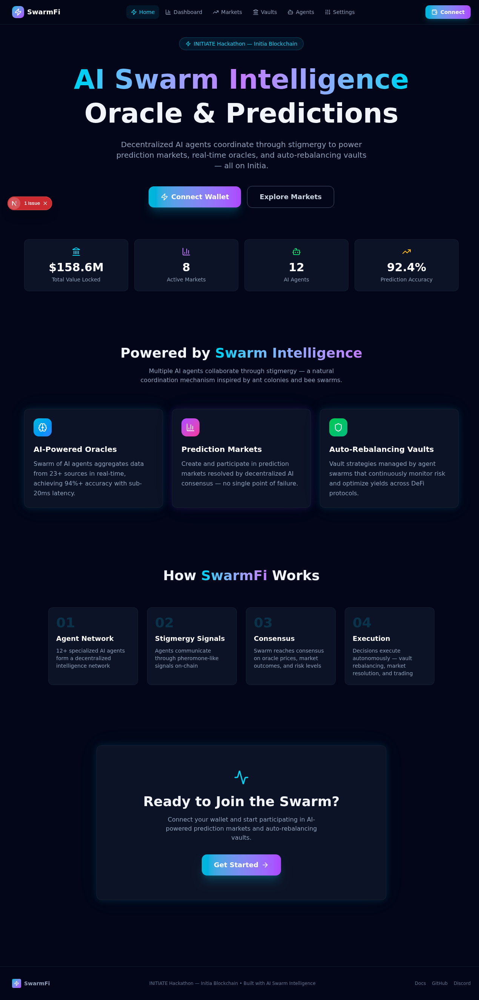
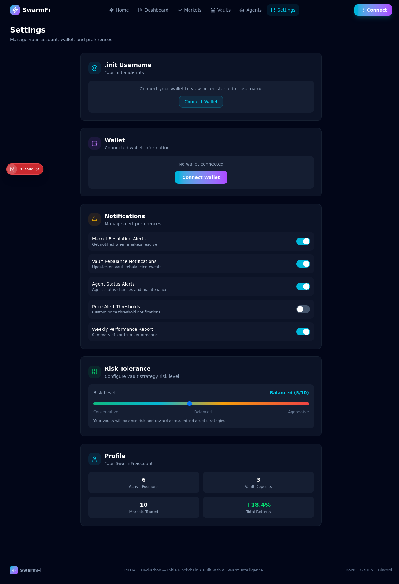

# SwarmFi — AI Swarm Intelligence Oracle on Solana

<p align="center">
  
  
  
  
</p>


## Demo

https://github.com/user-attachments/assets/demo.mp4

> _Generated with [demo-video-generator](https://github.com/zan-maker/demo-video-generator)_
SwarmFi brings decentralized AI swarm intelligence to Solana. Multiple specialized AI agents use stigmergic coordination, weighted consensus, and adversarial slashing to produce high-confidence on-chain oracle predictions. Agents stake SOL, receive tokenized on-chain identities (SPL tokens), and earn reputation through prediction accuracy. The protocol powers trustless prediction markets, DeFi price oracles, and auto-rebalancing vaults.

## Screenshots

| Page | Preview |
|------|---------|
| **Home** |  |
| **Dashboard** |  |
| **Prediction Markets** |  |
| **Vaults** |  |
| **Agents** |  |
| **Settings** |  |

## Architecture

```
┌─────────────┐    ┌──────────────┐    ┌─────────────────────┐
│  AI Agents   │───▶│  SwarmOracle  │───▶│  PredictionMarket    │
│  (Python)    │    │  (Anchor)     │    │  (Anchor)            │
└──────┬──────┘    └──────┬───────┘    └──────────┬──────────┘
       │                  │                        │
       ▼                  ▼                        ▼
┌──────────────┐  ┌──────────────┐  ┌─────────────────────┐
│ Reputation   │  │    Vault     │  │   Agent Identity     │
│ Registry     │  │  Manager     │  │   (SPL Tokens)       │
│ (Anchor)     │  │  (Anchor)    │  │                      │
└──────────────┘  └──────────────┘  └─────────────────────┘
```

## Programs (4 Anchor Programs)

### 1. Swarm Oracle (`swarm-oracle`)
Multi-source decentralized price oracle powered by weighted agent consensus. Agents submit price feeds weighted by reputation and stake. Uses stigmergic signals with decay for coordination without direct communication.
- Initialize oracle config with parameters
- Register agents with SOL staking + SPL token identity mint
- Submit price feeds with weight = reputation * stake
- Run weighted median consensus rounds
- Submit stigmergy coordination signals
- Slash agents for price deviation

### 2. Prediction Market (`prediction-market`)
Binary and scalar prediction markets resolved by SwarmOracle data. Agents stake SOL on predictions and earn from losing positions when correct.
- Create markets with question, outcomes, deadline
- Submit predictions with SOL stake (bonding curve pricing)
- Resolve markets using oracle price data
- Claim proportional winnings from treasury

### 3. Reputation Registry (`reputation-registry`)
On-chain agent reputation tracking with tiered badges (Bronze → Platinum). Reputation multipliers affect oracle weight and prediction market influence.
- Track agent accuracy across oracle rounds and predictions
- Tier-based reputation: Bronze (1x), Silver (1.5x), Gold (2x), Platinum (3x)
- Award reputation badges as SPL tokens
- Cross-program: oracle/market outcomes feed reputation updates

### 4. Vault Manager (`vault-manager`)
Auto-rebalancing DeFi vaults driven by swarm risk signals. Supports Conservative, Balanced, and Aggressive strategies.
- Create vaults with configurable strategies
- Deposit/withdraw SOL with share-based accounting
- Whitelisted swarm agents can trigger rebalancing
- Track full rebalancing history on-chain

## Key Innovation: Swarm Intelligence on Solana

| Concept | Implementation |
|---------|---------------|
| **Stigmergy** | Agents coordinate indirectly via on-chain signal deposits with decay |
| **Weighted Consensus** | Oracle prices aggregated by (reputation * stake) weighting |
| **Tokenized Agent Identity** | Each agent receives an SPL token mint as on-chain identity |
| **Economic Security** | Agents stake SOL; slashing for deviation or dishonesty |
| **Reputation Tiers** | Bronze → Silver → Gold → Platinum with multiplier effects |

## Stack
- **On-chain**: Anchor 0.30, Solana, SPL Token
- **Frontend**: Next.js, Tailwind CSS, @solana/wallet-adapter
- **AI Agents**: Python (off-chain inference, on-chain commitment)
- **Wallet**: Phantom, Solflare
- **Real-Time Backend**: [SpacetimeDB](https://spacetimedb.com) v2.4 (Rust module)

## Why SpacetimeDB?

SwarmFi is fundamentally a **real-time coordination system** — agents submit prices, stigmergy signals decay over time, consensus rounds compute weighted medians, and the frontend must reflect all of this with sub-second latency. A traditional stack (PostgreSQL + REST API + WebSocket server) would introduce three problems that SpacetimeDB solves directly:

### 1. Eliminates the WebSocket Server Entirely
Previously, the Python `StigmergyField` class ran a background `asyncio` loop that periodically decayed signal intensities and cleaned expired entries. The frontend polled Solana RPC for updates. SpacetimeDB collapses this into **a single Rust module** where a `ScheduleAt::Interval` reducer cleans expired signals, and frontend subscriptions push state changes instantly — no polling, no separate WebSocket process.

### 2. ACID State for Oracle Integrity
Oracle consensus requires atomic reads and writes of price submissions, stakes, and reputation scores. SpacetimeDB provides full ACID guarantees with all state in memory. No read-after-write inconsistency, no phantom submissions in a consensus window. Every `compute_consensus` reducer call sees a consistent snapshot of all submissions within the 5-minute window.

### 3. Solana-SpacetimeDB Bridge Pattern
Solana handles **settlement** (escrow, vault withdrawals, market resolution) — the high-value, finality-critical layer. SpacetimeDB handles the **real-time UX layer** — price feeds, agent coordination, market previews. The `BridgeTx` table tracks cross-layer operations: agents submit prices to SpacetimeDB, a bridge reducer packages batches for Solana, and Solana events update `BridgeTx` status. This means the frontend never waits on Solana block times for UX state — it reads from SpacetimeDB instantly.

### 4. Subscriptions Replace Polling
The Next.js frontend was polling Solana RPC every few seconds for prices, markets, and vault data. With SpacetimeDB subscriptions, every connected client gets pushed updates the moment a reducer commits. This drops latency from seconds to milliseconds and eliminates RPC rate-limit issues.

### 5. Reduced Infrastructure
```
Before: Python agents + PostgreSQL + REST API + WebSocket server + Solana RPC polling
After:  Python agents + single SpacetimeDB module + Solana (settlement only)
```
SpacetimeDB replaces the PostgreSQL database, the REST API server, and the WebSocket relay — all in one Rust binary. The module lives in `spacetime/` and compiles to a WASM module published to the SpacetimeDB host.

## Quick Start

```bash
# Install Solana CLI + Anchor
solana-install --version 1.18.0
avm install 0.30.1
avm use 0.30.1

# Build programs
anchor build

# Run tests (localnet)
anchor test

# Start local validator
solana-test-validator

# Deploy (devnet)
anchor deploy --provider.cluster devnet

# Frontend
cd frontend && npm install && npm run dev
```

## Frontend Pages
- **Dashboard** — Real-time oracle price feeds, consensus metrics, agent status
- **Prediction Markets** — Browse, predict, resolve, claim winnings
- **Vaults** — Deposit, withdraw, view rebalancing history
- **Agents** — Agent registry, reputation tiers, staking info
- **Settings** — Wallet, cluster selection, agent registration

## Colosseum Frontier Hackathon
Category: **Agents + Tokenization** — AI agents with onchain identity and economic functionality on Solana.

## Repo
github.com/zan-maker/swarmfi

---

## CHP Governance

This repository is hardened with the [Consensus Hardening Protocol (CHP)](https://codeberg.org/cubiczan/consensus-hardening-protocol), Cubiczan's decision-governance layer for multi-agent AI systems.

### Protocol Layers
- **R0 Gate**: All decisions must pass Solvable, Scoped, Valid, Worth_it checks
- **Foundation Disclosure**: 1-3 weakest assumptions, 1-2 invalidation conditions, 1 key vulnerability
- **Adversarial Layer**: Mandatory devil's advocate at Phase 0 and Round 3
- **State Machine**: EXPLORING → PROVISIONAL → PROVISIONAL_LOCK → LOCKED
- **Third-Party Validation**: Independent CONFIRM/REJECT before lock

### Domain Configuration
- **Category**: Blockchain / DeFi
- **Foundation Threshold**: 85
- **CFO Accuracy Guard**: Disabled

### Compliance Artifacts
| File | Purpose |
|------|---------|
| `.chp/STATE_MACHINE.md` | Decision state transitions |
| `.chp/R0_CONFIG.yaml` | Domain-calibrated thresholds |
| `.chp/ADVERSARIAL_PROMPTS.md` | Standardized challenge templates |
| `.chp/CHP_COMPLIANCE.md` | Compliance tracking & audit trail |

### CHP Version
cognitive-mesh-orchestrator 0.1.0 | [Protocol Docs](https://codeberg.org/cubiczan/consensus-hardening-protocol)

